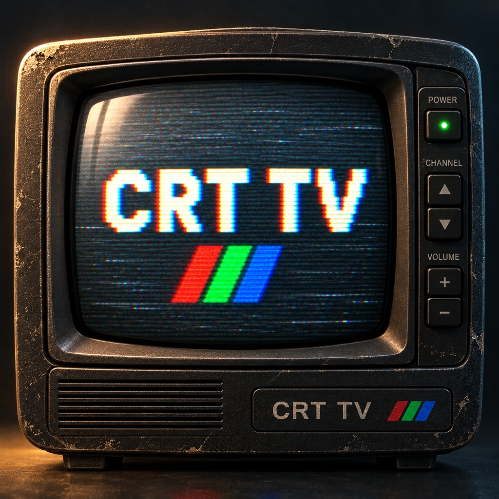

# CRT TV — Vintage Television Video Player for Android

<p align="center">
  
</p>

<p align="center">
  <strong>A nostalgic, fully offline retro television video player built with Jetpack Compose & Media3 for Android.</strong>
</p>

<p align="center">
  
  
  
  
  
</p>

---

## 📺 Overview

**CRT TV** is an authentic retro video player experience that transforms your Android device into a realistic 1990s cathode-ray tube television. Rather than simply overlaying a generic filter onto a modern media player, **CRT TV** simulates the complete physical and optical behavior of vintage televisions—from molded chassis bezels and tactile hardware buttons to analog RF static, scanline beam physics, and television channel surfing.

Operating 100% offline, **CRT TV** requires no accounts, no cloud backend, and zero internet connection.

---

## ✨ Key Features

### 1. 🎛️ Physical TV Cabinet Skins
Every preset features a distinct, realistic physical television chassis encasing the display:
* **Classic**: Molded 1990s dark graphite television chassis with horizontal cooling louvers, corner Phillips screws, dual stereo speaker columns, and metallic brand plate.
* **VHS**: Warm walnut woodgrain cabinet with beveled trim, brass corner reinforcement brackets, front-loading VHS deck slot with tracking indicator, and 3-color RCA A/V composite jacks (Yellow, White, Red).
* **Retro**: 1980s desktop computer monitor enclosure with ribbed cooling vents and a cream/tan ABS plastic finish.
* **Arcade**: Heavy arcade cabinet monitor casing with a vibrant **5dp red rubber T-molding** border and coin-op aesthetic.
* **News**: Broadcast master rack monitor in brushed gunmetal steel with left & right 19" rack-mount ears and oval bolt slots.
* **Broken**: Weathered CRT chassis with silver duct tape peeling over fractured corner bezels and realistic front glass crack overlays.

### 2. ⚡ Real-Time CRT Shaders & Optical Effects
Powered by an OpenGL `TextureView` rendering pipeline that blends shaders directly over video frames:
* **Drifting Scanlines**: Cathode beam sweep lines rendered with `BlendMode.Multiply`.
* **Aperture Grille**: RGB subpixel phosphor stripe masks.
* **Analog Dust & Film Grain**: Authentic micro-scratches and dust particle texture.
* **Tube Curvature & Radial Vignette**: Bulging glass geometry with realistic corner luminescence falloff.
* **Power Collapse Transition**: Authentic horizontal and vertical beam collapse with phosphor afterglow when turning off.

### 3. 📡 Analog Channel Surfing (`CH +` / `CH -`)
* **Local Video Channel Mapping**: Automatically assigns each local video in your device library to a numbered TV channel (`CH 01`, `CH 02`, etc.).
* **Channel Tuning**: Pressing **`CH +`** or **`CH -`** surfs through your video library with a brief analog static burst and vintage phosphor green On-Screen Display (OSD) readout (`CH 02: TITLE.MP4`).
* **Test Patterns**: If no videos are loaded, the tuner switches between authentic test channels: SMPTE color bars, RF static snow ("NO SIGNAL"), and blue screen.

### 4. 🔘 Molded 3D Physical Hardware Controls
* **Recessed Sockets & Bevels**: Buttons sit in molded well sockets and depress on touch with specular edge lighting.
* **Haptic Feedback**: Mechanical click sensation via system haptic actuators.
* **Faceted Jewel LED**: Glowing power indicator (deep standby ruby, radiant phosphor emerald when active).
* **Split Rocker Switches**: Tactile rockers for volume and channel tuning with center separator grooves.
* **Native Edge Gesture**: Swiping from the left screen edge opens the retro navigation drawer—no modern menu buttons on the chassis.

### 5. 📂 Automatic Device Video Discovery & SAF Picker
* **Direct MediaStore Scanning**: Automatically queries `MediaStore.Video.Media.EXTERNAL_CONTENT_URI` to detect all local videos on the device (Camera, Downloads, Movies).
* **Modern Permissions**: Full support for Android 13+ (`READ_MEDIA_VIDEO`) and Android 12- (`READ_EXTERNAL_STORAGE`).
* **Storage Access Framework (SAF)**: `+ PICK FILES` allows opening videos from external storage, SD cards, and custom folders.
* **Tabs & Sorting**: Browse by Videos, Folders, or Favorites; sort by Date Added, Name, or Duration.

### 6. 🎚️ Deep Calibration & Custom Presets
Adjust any optical CRT parameter in real-time:
* Scanline Density (0% – 100%)
* Cathode Curvature (Flat – Heavy Bulb)
* RF Noise & Tape Hiss (Clean – Static)
* Color Bleed & RGB Chromatic Aberration
* Tube Brightness & Contrast Boost
* Screen Refresh Flicker Rate (60Hz / 50Hz / Variable)
* Aspect Ratio Mode (Vintage 4:3, Modern 16:9, Original)

---

## 🏗️ Architecture & Tech Stack

```
com.retro.crttv/
├── crt/                   # AGSL & Canvas CRT shaders, presets, aspect ratios
├── data/
│   ├── model/             # VideoItem and data structures
│   ├── preferences/       # DataStore preference repositories
│   └── repository/        # VideoRepository (MediaStore & SAF queries)
├── player/                # Media3 ExoPlayer manager & player state machine
├── ui/
│   ├── components/        # CrtTvFrame, CrtButtons, CrtOsdOverlay, NavigationDrawer
│   ├── home/              # Main TV Screen with TextureView video rendering
│   ├── library/           # Local video library with storage permission flow
│   ├── navigation/        # Navigation routing
│   ├── presets/           # Preset selector & live preview
│   ├── settings/          # CRT calibration sliders & settings
│   ├── splash/            # Retro cathode startup splash screen
│   └── theme/             # Vintage color tokens & typography
└── viewmodel/             # MVVM ViewModels (Player, Library, Settings)
```

* **Language**: Kotlin 2.0.0
* **UI Framework**: Jetpack Compose (BOM `2024.06.00`)
* **Target SDK**: Android 35 (Vanilla Ice Cream) / Min SDK 26 (Android 8.0 Oreo)
* **Media Engine**: AndroidX Media3 / ExoPlayer 1.3.1
* **Persistence**: Jetpack DataStore Preferences 1.1.1
* **Architecture Pattern**: MVVM with Clean Architecture & Unidirectional Data Flow (StateFlow)

---

## 🚀 Getting Started

### Prerequisites
* **Android Studio**: Ladybug (2024.2.1) or newer
* **JDK**: Version 17
* **Android SDK**: Platform 35 installed via SDK Manager

### Building from Source

1. **Clone the repository**:
   ```bash
   git clone https://github.com/<your-username>/crt-tv-video-player.git
   cd crt-tv-video-player
   ```

2. **Build Debug APK**:
   ```bash
   ./gradlew assembleDebug
   ```

3. **Install on Device / Emulator**:
   ```bash
   ./gradlew installDebug
   ```

The compiled APK will be located at:
```
app/build/outputs/apk/debug/app-debug.apk
```

---

## 🔒 Security & Privacy

* **No Secrets Committed**: All API keys, keystores, and machine-specific configuration files (`local.properties`, `.gradle/`, `build/`) are strictly ignored via `.gitignore`.
* **Zero Tracking**: No analytics, telemetry, or network requests. Operates entirely local on-device.

---

## 📄 License

This project is licensed under the MIT License - see the [LICENSE](LICENSE) file for details.
